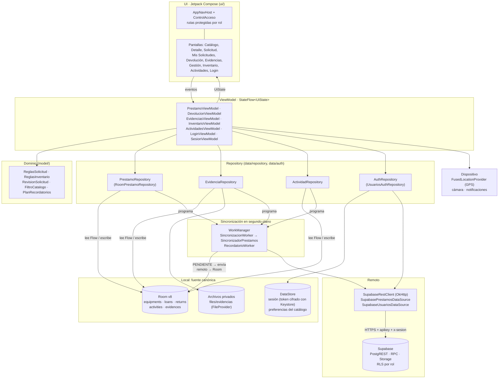

# Arquitectura: PréstamoLab CTMA

Evidencia de la semana 6 (*diagrama actualizado de arquitectura local*) y de la sección 6 de la guía. El diagrama
muestra las clases reales del código (`app/src/main/java/com/example/prestamolab/`).

## Capas y flujo de datos

## Responsabilidades

| Capa | Qué hace | Qué no hace |
|---|---|---|
| UI (Compose) | Muestra el `UiState` con `collectAsStateWithLifecycle` y envía eventos al ViewModel. Pide los permisos en el momento en que se usan | No conoce Room, OkHttp ni el contenedor de dependencias |
| ViewModel | Coordina la pantalla: valida con el dominio, llama al Repository y expone un único `StateFlow` de solo lectura con estados de carga, contenido, vacío, error y operación en curso | No hace consultas SQL ni HTTP |
| Dominio | Reglas puras y probadas sin Android: límites de la solicitud (TDD), inventario, revisión, filtro y plan de recordatorios | No depende de ninguna capa |
| Repository | Punto único de acceso a los datos. Escribe en Room con estado `PENDIENTE` y programa la sincronización | No bloquea la UI esperando la red |
| Room | Fuente local canónica: la UI solo lee de aquí, mediante `Flow` | — |
| DataStore | Sesión (el token va cifrado con Android Keystore) y filtro del catálogo | No guarda datos del negocio |
| WorkManager | Envía los registros `PENDIENTE`, recibe los remotos y reintenta con espera exponencial ante 5xx o sin red. Ante 401 cierra la sesión | — |
| Remoto | `SupabaseRestClient` encapsula OkHttp, cabeceras, timeouts y errores HTTP (`SupabaseHttpException`). El contrato está en `docs/CONTRATO_API.md` | — |

## Decisiones

- **Local-first:** una acción del usuario se guarda primero en Room y la pantalla se actualiza enseguida. La red sincroniza después, así la app funciona sin conexión (HU-06) y se puede reintentar sin perder datos (HU-07).
- **Tres modelos por entidad:** DTO remoto (`EquipoRemoto`, `PrestamoRemoto`…) ↔ modelo de dominio (`Equipo`, `SolicitudPrestamo`…) ↔ entidad de Room (`EquipmentEntity`, `LoanEntity`…). El mapeo vive en la capa de datos (`SincronizadorPrestamos`, `RoomPrestamoRepository`), y la UI solo usa el dominio.
- **OkHttp sin Retrofit:** la guía menciona "Retrofit/OkHttp". PostgREST arma las consultas en la URL (`select=`, `eq.`, `order=`), así que un cliente pequeño sobre OkHttp (124 líneas) es suficiente y se prueba por completo con MockWebServer (`SupabasePrestamosDataSourceTest`).
- **Inyección manual:** `AppContainer` crea las dependencias, y las pruebas instrumentadas las reemplazan (`PrestamoLabTestRunner`, `FakeUsuariosDataSource`). No se usa Hilt porque el proyecto no lo necesita a este tamaño.
- **Ambientes:** la URL y la clave de cada ambiente se eligen al compilar (`docs/AMBIENTES.md`).
